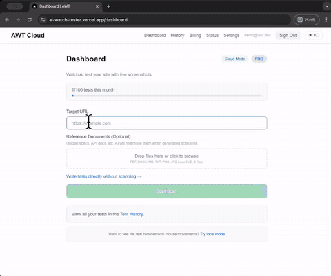

<p align="center">
  <picture>
    <source media="(prefers-color-scheme: dark)" srcset="docs/assets/logo-dark.png">
    <source media="(prefers-color-scheme: light)" srcset="docs/assets/logo-light.png">
    
  </picture>
  <br/>
  <strong>AWT — AI Watch Tester</strong>
  <br/>
  <em>Enter a URL. AI generates, executes, and heals E2E tests — automatically.</em>
  <br/><br/>
  <a href="https://github.com/ksgisang/AI-Watch-Tester/actions"></a>
  <a href="LICENSE"></a>
  <a href="https://www.python.org/"></a>
  <a href="https://ai-watch-tester.vercel.app"></a>
  <a href="https://github.com/ksgisang/awt-skill"></a>
  <a href="https://github.com/ksgisang/AI-Watch-Tester/stargazers"></a>
</p>

---

## Demo

<p align="center">
  
  <br/>
  <em>Enter a URL → AI scans your site → generates test scenarios → executes with live screenshots → reports results.</em>
</p>

---

## Why AWT?

Most E2E testing tools still require you to **write code** or **record flows** before you can run a single test. AWT flips that model:

1. **You provide a URL** (and optionally a spec document).
2. **AI analyzes** the page structure, forms, navigation, and auth flows.
3. **AI generates** complete YAML test scenarios with selectors, test data, and assertions.
4. **Playwright executes** the scenarios in a real browser with humanized input.
5. **If a test fails**, the DevQA Loop kicks in — AI reads the failure, fixes the scenario or source code, and re-runs.

No test code. No recording. No manual maintenance.

---

## Three Ways to Use AWT

Pick one — or use all three.

| | **Cloud** | **Local CLI** | **Agent Skill** |
|---|-----------|---------------|-----------------|
| **URL** | [ai-watch-tester.vercel.app](https://ai-watch-tester.vercel.app) | `aat dashboard` → localhost:9500 | Works inside your AI coding tool |
| **Install** | None — just sign up | `pip install aat-devqa` | `npx skills add ksgisang/awt-skill` |
| **Browser** | Headless Chromium on server | Real Chromium on your machine | Real Chromium on your machine |
| **AI key** | Server-provided or BYOK | Your own key (OpenAI / Anthropic / Ollama) | **None needed** — your AI tool is the brain |
| **Best for** | PMs, planners, quick tests | Developers, CI/CD, offline use | AI-assisted dev with integrated testing |
| **Pricing** | Free (5/mo) · Pro $28.99 · Team $98.99 | Free forever (MIT, unlimited) | Free forever |
| **Data** | Stored on our servers | Never leaves your machine | Never leaves your machine |

### Cloud — Start in 30 seconds

```
1. Visit https://ai-watch-tester.vercel.app
2. Sign up (email or GitHub)
3. Enter your target URL
4. Watch AI generate and execute tests
```

### Local CLI — Full control

```bash
pip install aat-devqa
playwright install chromium

# Option 1: Web dashboard
aat dashboard                    # http://localhost:9500

# Option 2: CLI
aat start                        # guided mode
aat generate --url https://example.com --provider openai
aat run scenarios/
```

### Agent Skill — Let your AI coding tool drive

AWT is also available as an [Agent Skill](https://github.com/ksgisang/awt-skill) for AI coding tools like Claude Code, Cursor, Codex, and [11+ others](https://github.com/ksgisang/awt-skill#supported-ai-coding-tools). Your AI tool writes YAML scenarios and runs AWT — **no extra AI API key needed**.

```bash
# Install globally (one-line)
npx skills add ksgisang/awt-skill --skill awt -g

# Then just ask your AI coding tool:
# "Test the login flow on https://mysite.com"
# → It writes scenarios, runs aat, reads results, and fixes failures automatically.
```

### From Source

```bash
git clone https://github.com/ksgisang/AI-Watch-Tester.git
cd AI-Watch-Tester
python -m venv .venv && source .venv/bin/activate
make dev          # install deps + playwright + pre-commit
make test         # verify everything works
aat dashboard     # launch web UI
```

---

## Features

| | Feature | Description |
|---|---------|-------------|
| :robot: | **AI Scenario Generation** | Upload a URL or spec doc (PDF/DOCX/MD) — AI creates E2E test scenarios |
| :globe_with_meridians: | **Real Browser Testing** | Playwright-driven Chromium with Bezier mouse curves and variable-speed typing |
| :recycle: | **Self-Healing DevQA Loop** | AI analyzes failures, patches code or scenarios, and re-runs automatically |
| :cloud: | **Cloud + Local** | Cloud mode (no install, browser dashboard) or local mode (real browser, full control) |
| :bar_chart: | **Live Dashboard** | Real-time screenshot streaming, step-by-step progress, event log |
| :page_facing_up: | **Document-Based Generation** | Feed PDF/DOCX/Markdown specs — AI generates scenarios from requirements |
| :key: | **BYOK** | Bring your own AI API key (OpenAI, Anthropic, Ollama) — encrypted at rest |
| :test_tube: | **CI/CD Ready** | One-line `curl` integration with any pipeline |
| :jigsaw: | **Plugin Architecture** | Engines, matchers, AI adapters, and reporters are all swappable via registries |
| :wrench: | **[Agent Skill](https://github.com/ksgisang/awt-skill)** | Use AWT inside Claude Code, Cursor, Codex, and 11+ AI coding tools — no extra AI key needed |

---

## Supported AI Providers

| Provider | Models | Cost | Setup |
|----------|--------|------|-------|
| **OpenAI** | gpt-4o, gpt-4o-mini | Pay-per-use | `export OPENAI_API_KEY=sk-...` |
| **Anthropic** | Claude Sonnet 4 | Pay-per-use | `export ANTHROPIC_API_KEY=sk-ant-...` |
| **Ollama** | codellama, llama3, mistral | Free (local GPU) | `ollama serve` |

Configure in `aat.yaml` or via environment variables:

```yaml
ai:
  provider: openai        # openai | anthropic | ollama
  model: gpt-4o
  api_key: ${OPENAI_API_KEY}
```

Cloud users can bring their own API key (BYOK) via **Settings > AI Provider**.

---

## How It Compares

### vs testRigor

| | **AWT** | **testRigor** |
|---|---------|---------------|
| Test authoring | AI generates from URL/docs — zero input | Plain English commands (you write) |
| Self-healing | DevQA Loop (AI re-generates) | Built-in auto-maintenance |
| Pricing | Free (MIT, self-host) | Enterprise pricing (~$800+/mo) |
| Open source | Yes | No |
| Setup time | Seconds (enter URL) | Minutes (write English scripts) |

**Choose AWT** if you want fully automated test generation with no scripting at all, or need a self-hostable open-source tool. **Choose testRigor** if you prefer writing plain-English test specs with enterprise support.

### vs Applitools

| | **AWT** | **Applitools** |
|---|---------|----------------|
| Primary focus | Functional E2E test generation + execution | Visual regression + cross-browser comparison |
| AI role | Generates entire test scenarios | Compares screenshots for visual differences |
| Standalone | Yes (full pipeline) | No (requires Cypress/Playwright/Selenium) |
| Pricing | Free (MIT) | Free tier + paid plans |

**Choose AWT** for AI-driven functional testing where you need scenarios generated automatically. **Choose Applitools** when pixel-perfect visual consistency across browsers is the priority. They complement each other — AWT generates and runs tests, Applitools can validate visual output.

### vs Playwright / Cypress

These are **excellent** browser automation frameworks that AWT is built on top of. The difference is **who writes the tests**: you (Playwright/Cypress) or AI (AWT). If your team wants full programmatic control, use them directly. If you want AI to handle test creation and maintenance, AWT fills that gap.

See [docs/COMPARISON.md](docs/COMPARISON.md) for a detailed breakdown against Playwright, Cypress, Testim, Katalon, and Mabl.

---

## Architecture

```
aat start / aat dashboard
       │
       ▼
┌─────────────────────────────────────────────┐
│                   CLI (Typer)                │
├─────────────────────────────────────────────┤
│              Core Orchestrator              │
│  ┌──────────┐ ┌──────────┐ ┌─────────────┐ │
│  │ Executor │ │Comparator│ │ DevQA Loop  │ │
│  └────┬─────┘ └────┬─────┘ └──────┬──────┘ │
├───────┼─────────────┼──────────────┼────────┤
│  ┌────▼────┐  ┌─────▼─────┐  ┌────▼─────┐  │
│  │ Engine  │  │  Matcher  │  │ Adapter  │  │
│  │Registry │  │ Registry  │  │ Registry │  │
│  └─────────┘  └───────────┘  └──────────┘  │
│  web|desktop  template|ocr   openai|claude  │
│               feature|hybrid ollama         │
├─────────────────────────────────────────────┤
│  Models (Pydantic v2)  │  Config (Settings) │
└─────────────────────────────────────────────┘
```

All modules follow **ABC + plugin registry** pattern — extend the base class, register in `__init__.py`, done.

---

## Development

### Prerequisites

- Python 3.11+
- [Tesseract OCR](https://github.com/tesseract-ocr/tesseract) — `brew install tesseract` / `apt install tesseract-ocr`
- Git

### Make Commands

| Command | Description |
|---------|-------------|
| `make dev` | Install all deps + Playwright + pre-commit |
| `make lint` | ruff check |
| `make format` | ruff format + auto-fix |
| `make typecheck` | mypy strict |
| `make test` | pytest |
| `make test-cov` | pytest + coverage report |
| `make clean` | Remove caches and build artifacts |

---

## Contributing

Contributions are welcome! See [CONTRIBUTING.md](CONTRIBUTING.md) for:

- Development environment setup
- Code style (ruff + mypy strict)
- Test writing guidelines
- Pull request process
- Plugin development (adding new engines, matchers, or AI adapters)

```bash
git checkout -b feat/my-feature
# make changes
make format && make lint && make typecheck && make test
git commit -m "feat(scope): description"
# open PR
```

---

## Documentation

| Document | Description |
|----------|-------------|
| [Quick Start Guide](docs/QUICK_START.md) | Install, configure, run your first test |
| [API Reference](docs/API_REFERENCE.md) | REST API + WebSocket documentation |
| [Comparison](docs/COMPARISON.md) | AWT vs Playwright, Cypress, Testim, Katalon, Mabl |
| [FAQ](docs/FAQ.md) | Common questions |
| [CI/CD Guide](cloud/docs/CI_CD_GUIDE.md) | Pipeline integration (GitHub Actions, GitLab CI) |
| [Cloud Backend](cloud/README.md) | Self-hosting the cloud backend |

---

## FAQ

<details>
<summary><strong>What is AWT?</strong></summary>
<br/>
AWT (AI Watch Tester) is an open-source, AI-powered E2E testing tool. You give it a URL, and it automatically generates test scenarios, executes them in a real browser (Playwright), and reports results — no test code required.
</details>

<details>
<summary><strong>How do I install it?</strong></summary>
<br/>

**Cloud (no install):** Visit [ai-watch-tester.vercel.app](https://ai-watch-tester.vercel.app) and enter a URL.

**Local:**
```bash
pip install aat-devqa
playwright install chromium
aat dashboard
```

**From source:**
```bash
git clone https://github.com/ksgisang/AI-Watch-Tester.git
cd AI-Watch-Tester
make dev && aat dashboard
```
</details>

<details>
<summary><strong>Which AI providers are supported?</strong></summary>
<br/>

| Provider | Models | Cost |
|----------|--------|------|
| **OpenAI** | gpt-4o, gpt-4o-mini | Pay-per-use |
| **Anthropic** | Claude Sonnet 4 | Pay-per-use |
| **Ollama** | codellama, llama3, mistral | Free (local GPU) |

Cloud users can bring their own API key (BYOK) via the Settings page. Keys are Fernet-encrypted at rest.
</details>

<details>
<summary><strong>How much does it cost?</strong></summary>
<br/>

| Plan | Price | Tests/month | Concurrent |
|------|-------|-------------|------------|
| **Free** | $0 | 5 | 1 |
| **Pro** | $28.99/mo | 100 | 3 |
| **Team** | $98.99/mo | 500 | 10 |

The open-source local mode is completely free with no limits — you just need your own AI API key.
</details>

<details>
<summary><strong>Is it open source?</strong></summary>
<br/>
Yes. AWT is licensed under the MIT License — free for personal and commercial use. You can self-host, modify, and distribute it. Contributions are welcome!
</details>

<details>
<summary><strong>Can I use it in CI/CD?</strong></summary>
<br/>

Yes. Pro and Team plans include API keys for CI/CD integration:

```bash
curl -X POST https://your-awt-server.com/api/v1/run \
  -H "X-API-Key: awt_your_key" \
  -H "Content-Type: application/json" \
  -d '{"target_url": "https://staging.example.com"}'
```

See the [CI/CD Guide](cloud/docs/CI_CD_GUIDE.md) for GitHub Actions and GitLab CI examples.
</details>

<details>
<summary><strong>Is my data secure?</strong></summary>
<br/>

- All traffic is encrypted via HTTPS/TLS
- BYOK API keys are Fernet-encrypted (AES-128-CBC + HMAC-SHA256) at rest
- Screenshots are auto-deleted after 7 days
- Database hosted on Supabase (AWS Seoul region)
- See our <a href="https://ai-watch-tester.vercel.app/privacy">Privacy Policy</a> for full details
</details>

---

## License

[MIT](LICENSE) — free for personal and commercial use.

---

<p align="center">
  <sub>Built with Playwright, OpenCV, and a lot of AI. Made by <a href="https://github.com/ksgisang">@ksgisang</a>.</sub>
</p>
