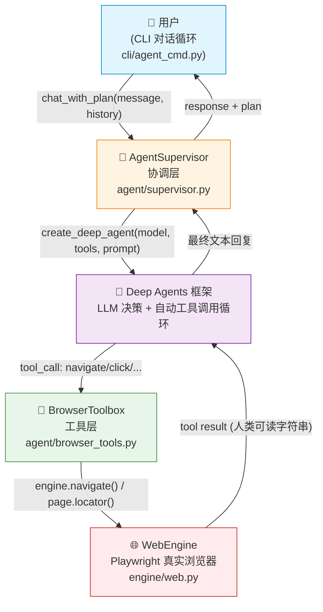
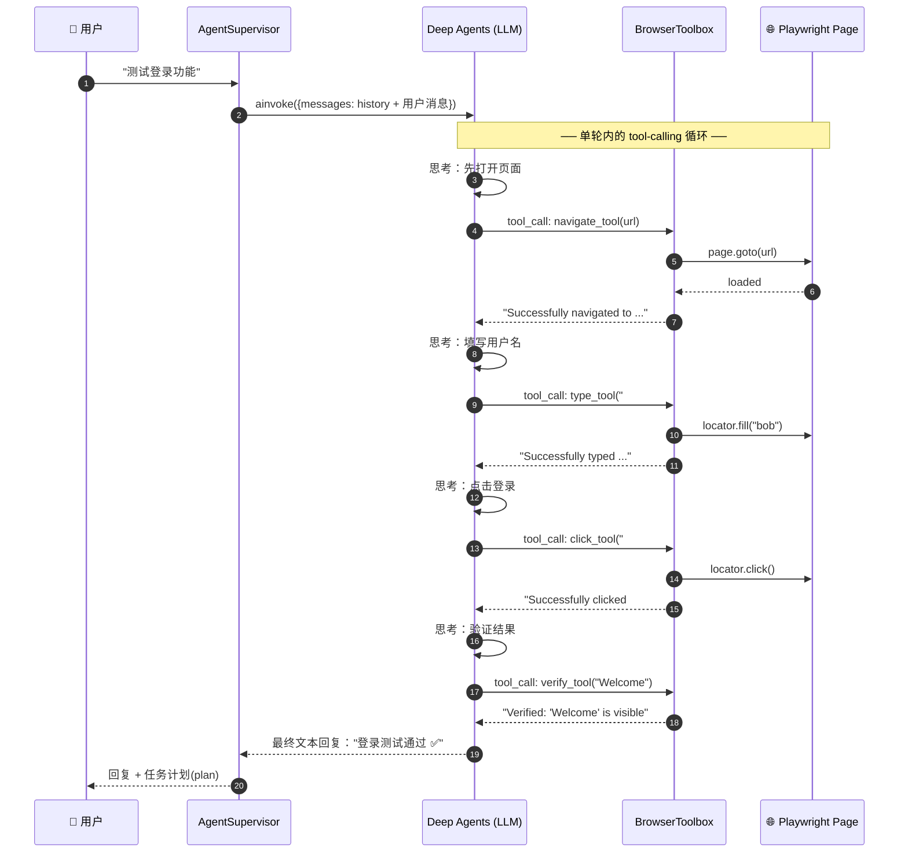
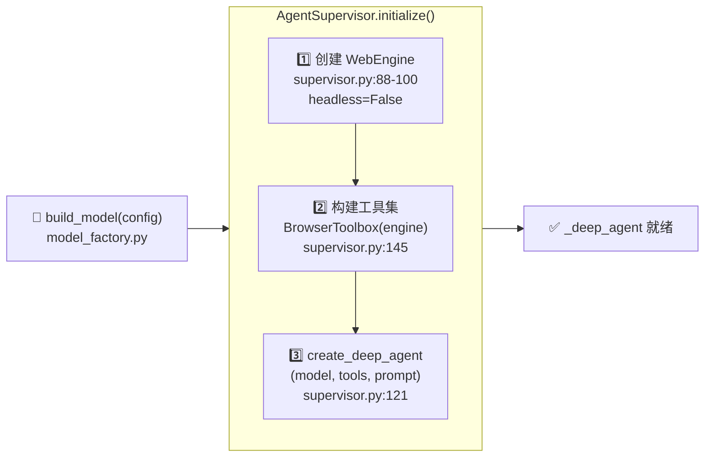
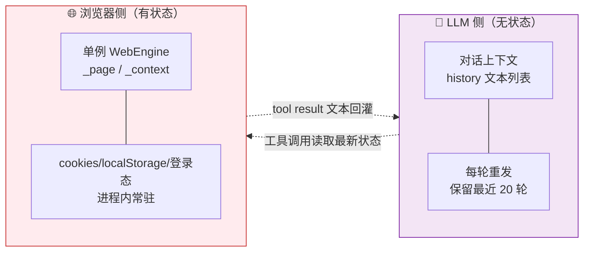
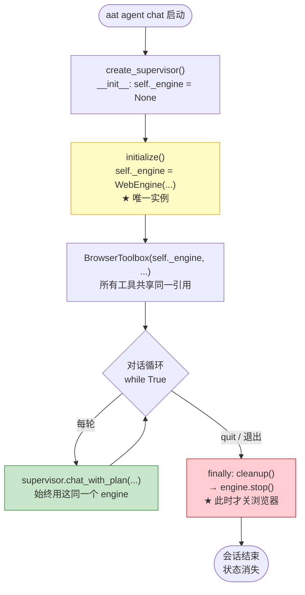
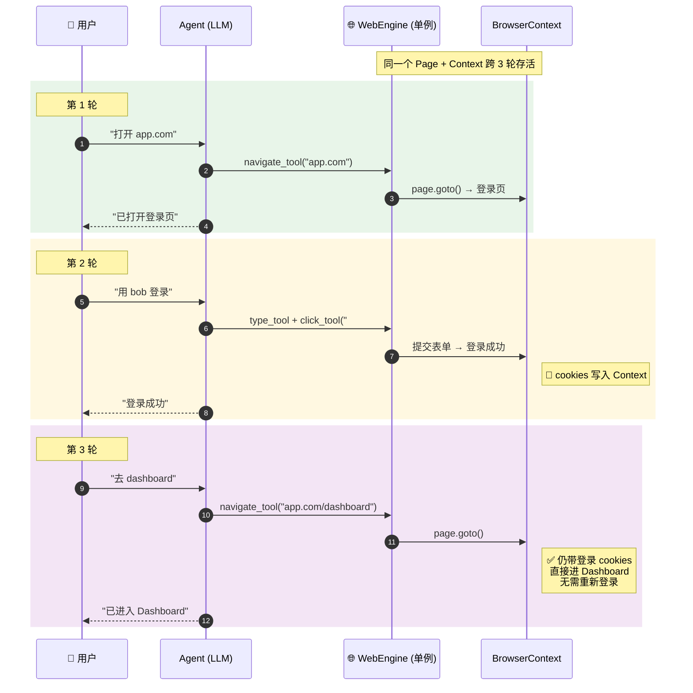
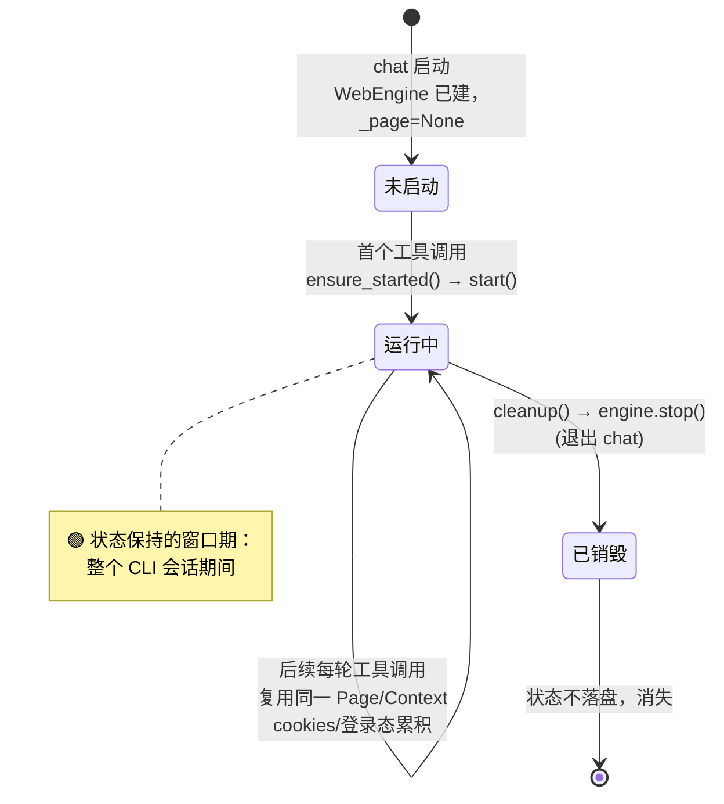

# Agent 浏览器驱动与多轮状态保持

> 适用范围：`aat agent chat`（基于 LangChain Deep Agents 的对话式测试代理）
> 相关代码：`src/aat/agent/`、`src/aat/cli/agent_cmd.py`、`src/aat/engine/web.py`

本文回答两个问题：

1. **驱动** —— `aat agent` 是如何调用浏览器、并通过多轮对话操作浏览器的？
2. **状态保持** —— 在多轮会话中，浏览器的状态（页面 DOM、登录态、cookies）是如何保持的?

---

## TL;DR

| 问题 | 一句话答案 |
|------|-----------|
| 怎么驱动浏览器？ | 浏览器操作封装成 LangChain `@tool`，由 **Deep Agents 的 tool-calling 循环**（思考 → 调工具 → 观察 → 再思考）自主驱动 Playwright。 |
| 多轮怎么连贯？ | CLI 维护 `history` 文本列表，每轮整体注入 `ainvoke({"messages": ...})`。 |
| 状态怎么不丢？ | **靠一个常驻的单例 `WebEngine` + 单个 `Page`/`Context`**，从首轮懒启动一直活到 `cleanup()`；cookies/localStorage 由 Playwright 进程内持有，退出即消失。 |

> 💡 **核心认知**：浏览器状态**不在 LLM 上下文里维持**，而是活在那个常驻的浏览器进程里。LLM 每轮是无状态的，靠"再次调用工具去读当前页面"来获取最新状态。

---

## 一、整体架构

`aat agent chat` = **LangChain Deep Agents 框架 + Tool-Calling + Playwright 浏览器引擎**。整条链路由四层构成：



关键认知：**LLM 并不"直接"操作浏览器**。浏览器被封装成一组 LangChain `@tool` 函数，LLM 通过标准的 tool-calling 协议来驱动。真正的"思考 → 操作 → 观察"循环发生在 Deep Agents 框架内部。

---

## 二、浏览器能力 = 一组 LangChain Tools

浏览器操作在 `agent/browser_tools.py` 中被封装为一组 `@tool`（`build_tools()`，`browser_tools.py:171`）：

| 工具 | 作用 | 底层调用 | 触发场景 |
|------|------|---------|---------|
| 🧭 `navigate_tool(url)` | 打开网页 | `engine.navigate()` → `page.goto()` | 测试起点 |
| 🖱️ `click_tool(selector)` | 点击元素 | `page.locator(selector).click()` | 按钮提交 |
| ⌨️ `type_tool(selector, text)` | 输入文本 | `locator.fill(text)` | 表单填写 |
| 🔍 `verify_tool(text)` | 校验文本可见 | `page.inner_text("body")` | 断言验证 |
| 📄 `get_text_tool(...)` | 读取页面内容（截断 8000 字） | `page.inner_text()` | 内容提取/观察 |
| 📸 `screenshot_tool(...)` | 截图存盘 | `engine.screenshot()` | 视觉证据 |
| 🔬 `analyze_tool(url)` | 导航 + 统计表单/按钮/链接数 | `page.evaluate(...)` | 页面结构分析 |

> 🔑 **设计要点**：每个工具返回**人类可读字符串**（如 `"Successfully clicked #login"`）。这个字符串会被 Deep Agents 自动作为 tool result 喂回给 LLM，LLM 据此决定下一步。

---

## 三、Tool-Calling 循环：单轮内部发生了什么

用户发一条消息后，在**单次 `ainvoke` 内部**，Deep Agents 会自主跑一个多步循环，直到 LLM 给出最终文本回复。这个循环对用户不可见：



> 📌 注意：这一连串 navigate → type → click → verify 全部发生**在一次用户提问内部**。history 里只记录用户消息和最终回复，**中间的工具调用过程不进入跨轮 history**。

---

## 四、工具与真实浏览器的绑定（在 `initialize()` 中完成）

`AgentSupervisor.initialize()`（`supervisor.py:74`）做三件事把链条串起来：



| Provider | 模型实例化方式 (`model_factory.py`) |
|----------|-----------------------------------|
| `anthropic` / `openai` | 走 `provider:model` 标识符，让 deepagents 直接解析 |
| `zhipuai` | 用 AWT 的 `ZhipuAIAdapter` 构造 `ChatOpenAI`（OpenAI 兼容协议） |

Deep Agents 把 **model + tools + system prompt** 组装成一个自带工具调用循环的 agent —— 这一层负责"多步推理 + 反复操作浏览器"。

---

## 五、多轮对话 = history 注入

多轮对话能力来自 `chat_with_plan()`（`supervisor.py:230`）与 CLI 循环（`agent_cmd.py:159`）的配合：

```python
# supervisor.py:242-245
messages = list(history) if history else []
messages.append({"role": "user", "content": message})
agent_response = await self._deep_agent.ainvoke({"messages": messages})
```

```python
# agent_cmd.py:181-184 —— CLI 维护并裁剪历史
history.append({"role": "user", "content": user_input})
history.append({"role": "assistant", "content": response})
if len(history) > 40:
    history = history[-40:]   # 保留最近 20 轮，控制 token
```

每轮把**完整对话历史 + 新消息**整体发送，这样用户说"再点一次刚才那个按钮"时，agent 能从 history 理解上下文。

> 📝 此外，`supervisor.py` 集成了 Deep Agents 的 `write_todos` 任务规划工具（`TodoListMiddleware`）。多步任务时 agent 会先写 checklist 并跟踪进度；CLI 用 `render_plan()` 渲染成可勾选列表展示（`agent_cmd.py:187`）。可通过 `enable_planning` 开关关闭。

---

## 六、多轮会话中浏览器状态如何保持 ⭐

> **核心结论**：浏览器状态不在 LLM 上下文里维持，而是靠一个**跨整个会话存活的 Playwright `Page` / `BrowserContext` 对象**。

### 6.1 两条独立链路



| 层面 | 载体 | 生命周期 |
|------|------|---------|
| **浏览器/页面状态**（DOM、cookies、localStorage、登录态） | 单例 `WebEngine` 内的 `_page` / `_context` | 整个 CLI 会话，直到 `cleanup()` |
| **对话上下文**（"刚才点了什么"） | `history` 列表，文本注入 `ainvoke` | 每轮重发，最多保留 20 轮 |

二者**完全独立**维持。常见误解是"多轮 = 把页面状态塞进 LLM"——其实不是。

### 6.2 单例 WebEngine：会话级只创建一次、只销毁一次

状态不丢的根基是 engine 实例只有一个、且活得够久：



证据：

- `supervisor.py:64` `self._engine = engine` —— supervisor 持有引用
- `supervisor.py:100` `self._engine = WebEngine(config=engine_config)` —— 只在 `initialize()` 建一次
- `agent_cmd.py:199` `await supervisor.cleanup()` 放在 `finally` —— 整个对话循环结束后才 stop
- `browser_tools.py:145` `BrowserToolbox(self._engine, ...)` —— 所有工具共享同一个 engine

因此从第 1 轮到第 N 轮，工具调用的 `engine.page` 永远指向**同一个** Playwright `Page` 对象。

### 6.3 单个 Page：DOM 和导航历史在它内部累积

`WebEngine.start()`（`web.py:175`）只创建**一个** page：

```python
self._browser  = await browser_type.launch(...)
self._context  = await self._browser.new_context(...)   # 持有 cookies/localStorage
self._page     = await self._context.new_page()         # 全程唯一
```

之后所有 `navigate` / `click` / `type` 都操作这个 `self._page`，从不新建。典型跨轮登录场景：



> 🍪 状态能跨轮保持的物理原因：Playwright 的 `BrowserContext` 在进程内持续持有 cookies / localStorage / sessionStorage，而它从第 1 轮一直活到 `cleanup()`。

### 6.4 懒启动 + `_started()` 守卫：保证复用同一个 page

`BrowserToolbox` 不在初始化时启动浏览器，而是**首次调用工具时**才 start（`browser_tools.py:28`）：

```python
async def ensure_started(self):
    if self.engine._page is None:        # browser_tools.py:32
        await self.engine.start()
```

`click` / `type` 等工具靠 `_started()`（`browser_tools.py:35-37`）判断是否已启动。一旦首轮 `ensure_started()` 启动过，`_page` 就不再是 `None`，后续所有轮次工具调用都**复用而非重启** —— 这正是状态不丢的关键守卫。

> ⚠️ 若每轮重启 engine，cookies 和登录态会**全部丢失**。守卫的意义就是阻止这一点。

### 6.5 （可选）跨进程持久化：`save_session` / `load_session`

`WebEngine` 还提供把状态**落盘**的能力（`web.py:231-273`）：

```python
await self._context.storage_state(path=str(p))      # 存 cookies + localStorage
# 重新建 context 时用 storage_state=... 恢复
```

| 场景 | 是否落盘 | 状态去向 |
|------|---------|---------|
| `aat agent chat` 多轮会话 | ❌ 默认不落盘 | 进程内单例，退出即消失 |
| `aat run` 脚本化执行 | ✅ 可用 save/load | 跨次运行恢复登录态 |

> 📌 当前 `agent chat` 流程**默认未调用** save/load —— 靠进程内单例即可。`cleanup()` 时只 `stop()`、不存盘，所以**退出 chat 后状态即消失**，下次需重来。

### 6.6 对话上下文如何补足"页面状态"的认知

浏览器状态自己活着，但 LLM 每轮无状态——它不知道当前页面长什么样。补足方式：

- 每次工具返回的可读字符串（`"Successfully logged in"`、`get_text` 读到的页面文本）会被 Deep Agents 回灌进当轮 LLM 上下文；
- 下一轮用户问"现在页面有什么按钮"时，LLM 会主动再调一次 `get_text_tool` / `analyze_tool` 去**读取当前真实页面**，而不是凭记忆猜。

即：**真实状态在浏览器里，LLM 通过"再次调用工具观察"获取最新状态**；history 只负责对话连贯性，不负责状态快照。

---

## 七、状态生命周期总览



---

## 八、速查清单

| 你想… | 看哪里 |
|-------|--------|
| 理解驱动链路 | [§一 架构图](#一整体架构) + [§三 tool-calling 时序图](#三tool-calling-循环单轮内部发生了什么) |
| 知道有哪些浏览器工具 | [§二 工具表](#二浏览器能力--一组-langchain-tools) |
| 搞清多轮状态为何不丢 | [§六 ⭐](#六多轮会话中浏览器状态如何保持-) + [§6.3 跨轮登录时序图](#63-单个-pagedom-和导航历史在它内部累积) |
| 知道状态什么时候消失 | [§七 生命周期](#七状态生命周期总览) |
| 落盘/跨进程恢复 | [§6.5 save_session/load_session](#65-可选跨进程持久化save_session--load_session) |
