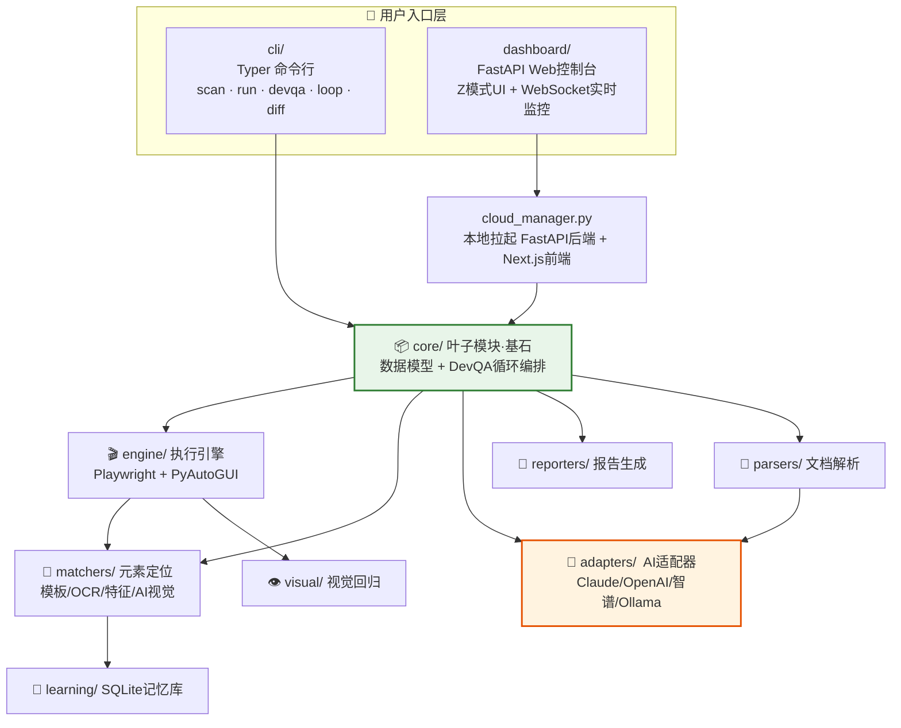
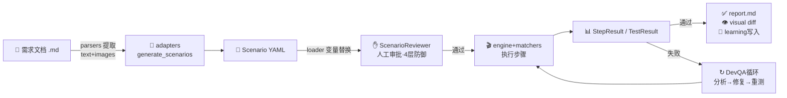
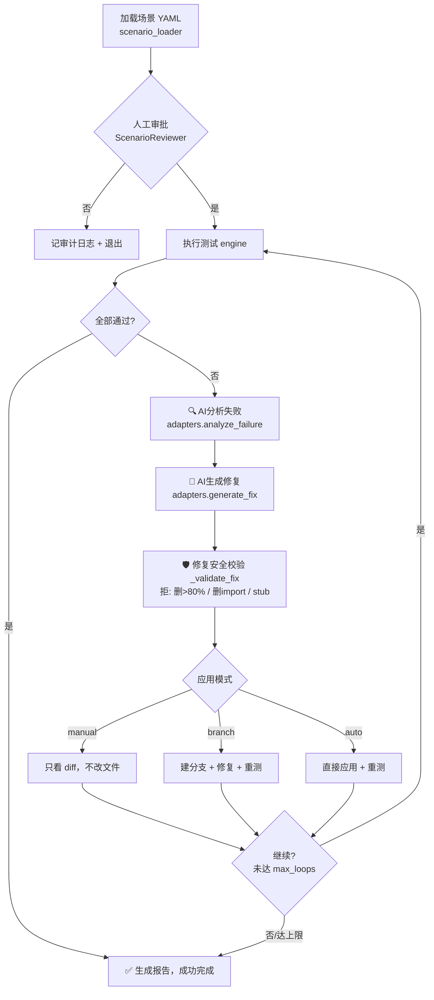
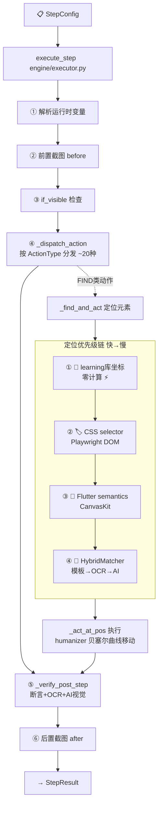
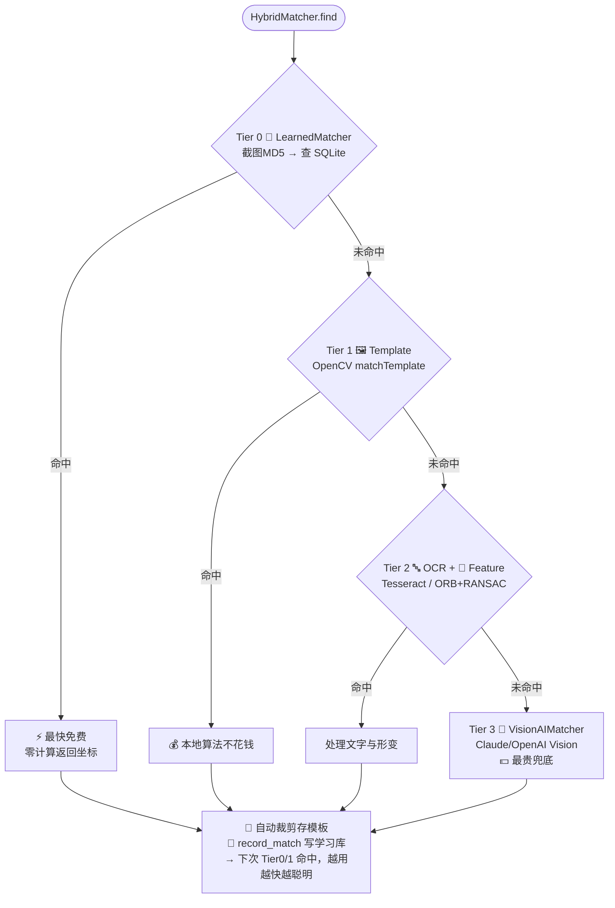
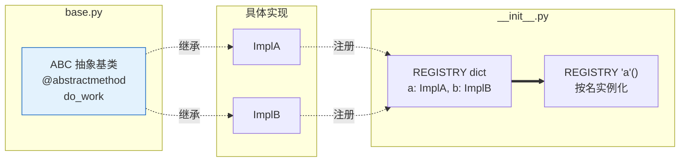
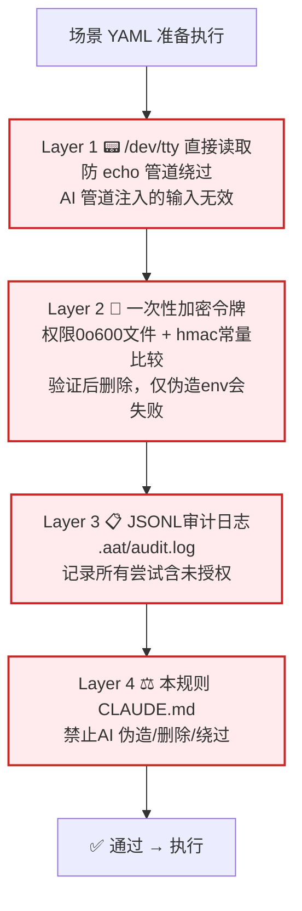
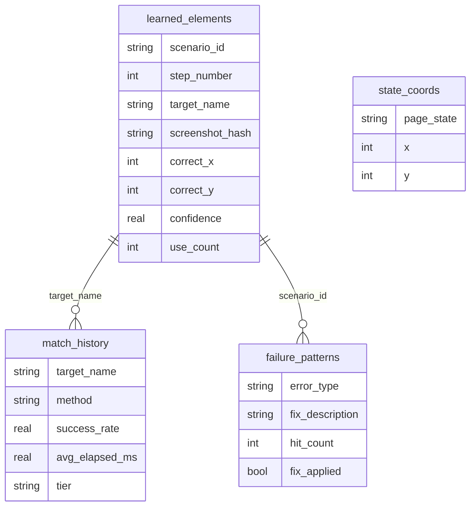

# AWT 架构图解 (Architecture Diagrams)

> 用 Mermaid 图讲清楚 **AI Watch Tester (AWT)** 的模块职责、数据流与核心机制。
> 所有图块均为 Mermaid 语法，在 GitHub、Notion、Typora、VS Code（装 Mermaid 预览插件）中自动渲染。

---

## 目录

1. [总体架构鸟瞰图](#1-总体架构鸟瞰图)
2. [核心数据流](#2-核心数据流)
3. [DevQA 循环（核心卖点）](#3-devqa-循环核心卖点)
4. [单步执行流水线](#4-单步执行流水线)
5. [匹配器三层回退](#5-匹配器三层回退)
6. [跨模块统一设计：ABC + 字典注册](#6-跨模块统一设计abc--字典注册)
7. [4 层审批防御](#7-4-层审批防御)
8. [learning SQLite 记忆库](#8-learning-sqlite-记忆库)
9. [模块职责速查表](#9-模块职责速查表)

---

## 1. 总体架构鸟瞰图

AWT 采用**分层 + 插件注册**架构，依赖单向流动：`core/` 是叶子模块（基石），所有其他模块单向依赖它，从而杜绝循环依赖。

**要点**

- `core/` 只依赖自己，定义全部数据模型（`Scenario` / `StepConfig` / `TargetSpec`）和编排逻辑（`DevQALoop`）。
- `dashboard/` 不直接调用 `engine`，而是**以子进程方式跑 CLI**，从而让 4 层审批逻辑完整生效。
- `engine` 调 `matchers` 定位元素；`matchers` 读写 `learning` 库实现「越用越快」。

---

## 2. 核心数据流

一条线串起所有模块：从需求文档到测试报告的完整路径。

**要点**

- `parsers/` 输出的 `(text, images)` 直接喂给 `adapters.generate_scenarios()` 生成场景。
- 失败时进入 DevQA 循环（详见 §3），通过后由 `reporters` + `visual` + `learning` 三路输出。

---

## 3. DevQA 循环（核心卖点）

「AI 自动分析失败 → 生成修复 → 安全校验 → 应用 → 重测」的闭环。

**三种应用模式**

| 模式 | 行为 | 适用场景 |
|------|------|---------|
| `manual` | 只生成修复并显示 diff，**不改文件** | 想先 review 再手动改 |
| `branch` | 建临时分支 `aat/fix-*`，应用修复、提交、在分支上重测，再切回 | 安全隔离改动 |
| `auto` | 直接写入工作目录并重测 | CI / 快速迭代 |

**修复安全校验** (`core/loop.py:_validate_fix`)：拒绝删除 >80% 原始行、删除全部 import、把大文件替换成 stub 的修复；按文件扩展名做语法校验。

---

## 4. 单步执行流水线

一个 `StepConfig` 如何变成真实操作（`engine/executor.py`）。

**要点**

- `_dispatch_action()` 用 `ActionType` 枚举 + if-elif 分发约 20 种动作（navigate / click / type / assert / wait…）。
- 定位优先级链从**最快**（learning 库哈希命中，零计算）到**最慢**（截图 + AI 视觉兜底）。
- `humanizer` 用贝塞尔曲线移动鼠标、变速打字、15% 概率过冲，模拟真人行为。

---

## 5. 匹配器三层回退

`matchers/` 的核心思想：**成本从低到高，命中即返回，能省 AI 调用就省。**

**各 Tier 算法**

| Tier | 方法 | 算法 / 技术 | 成本 |
|------|------|------------|------|
| 0 | `LearnedMatcher` | 截图 MD5 查 SQLite | 免费 ⚡ |
| 1 | `TemplateMatcher` | OpenCV `matchTemplate`（归一化相关系数）+ 多尺度 | 本地 |
| 2 | `OCRMatcher` / `FeatureMatcher` | Tesseract 文本定位；ORB 特征点 + Lowe 比率 + RANSAC | 本地 |
| 3 | `VisionAIMatcher` | Claude / OpenAI Vision 返回坐标 JSON | 最贵 💵 |

---

## 6. 跨模块统一设计：ABC + 字典注册

5 个子模块都套同一套插件模式，这就是扩展性极强的原因。

**各模块注册表**

| 模块 | 注册表 | 内容 |
|------|--------|------|
| `engine/` | `ENGINE_REGISTRY` | `web`, `desktop` |
| `matchers/` | `MATCHER_REGISTRY` | `template`, `ocr`, `feature`, `hybrid`, `vision_ai` |
| `adapters/` | `ADAPTER_REGISTRY` | `claude`, `openai`, `gemini`, `deepseek`, `ollama`, `zhipuai` |
| `reporters/` | `REPORTER_REGISTRY` | `markdown`, … |
| `parsers/` | `PARSER_REGISTRY` | `.md`, `.txt` |

➕ **新增一种引擎/适配器 = 实现 ABC + 加一行到字典，零侵入。**

---

## 7. 4 层审批防御

CLAUDE.md 反复强调的安全机制，防止 AI 偷偷自动跑测试（防绕过）。

| Layer | 机制 | 防御目标 |
|-------|------|---------|
| 1 | 直接读 `/dev/tty` | 防 `echo "" \| aat run` 管道绕过 |
| 2 | 一次性加密令牌（0o600 文件 + `hmac.compare_digest`，用后删除） | 防伪造环境变量 |
| 3 | `.aat/audit.log` JSONL 审计 | 全程可追溯 |
| 4 | CLAUDE.md 规则约束 AI 行为 | 禁止 `--auto-approve` / `-y`、伪造令牌、删审计 |

---

## 8. learning SQLite 记忆库

`learning/store.py` 用 SQLite（WAL 模式）持久化测试知识，使后续运行**越用越快、越用越省**。

**核心查询**：`get_best_method()` 按「成功率优先、平均耗时次之」聚合 `match_history`，供 HybridMatcher 自适应选择最佳匹配方法。

---

## 9. 模块职责速查表

| 模块 | 一句话职责 | 核心技术 | 大致代码量 |
|------|-----------|---------|-----------|
| **core/** | 数据模型 + DevQA 循环编排（叶子模块） | Pydantic v2 | ~2700 |
| **engine/** | 执行测试步骤（点击/输入/导航/断言） | Playwright + PyAutoGUI | ~4900 |
| **matchers/** | 在截图中定位 UI 元素，返回坐标 | OpenCV + Tesseract + Vision AI | ~1100 |
| **adapters/** | 统一 6 家 LLM 接口（分析/修复/生成） | anthropic / openai / httpx SDK | ~1800 |
| **reporters/** | 生成测试报告 | 字符串渲染 + JSON | ~250 |
| **parsers/** | 文档解析为 (text, images) | 正则 | ~100 |
| **dashboard/** | Web 实时监控台 | FastAPI + WebSocket | ~2300 |
| **learning/** | SQLite 记忆库，越用越快省 | SQLite WAL | ~900 |
| **visual/** | 视觉回归 + watch 模式 + 控制台收集 | SSIM + watchfiles | ~660 |
| **cli/** | Typer 命令行入口 + 审批安全 | Typer + asyncio | ~6600 |
| **cloud_manager.py** | 本地拉起云服务 | subprocess | ~800 |

---

## 如何渲染这些图

| 用途 | 做法 |
|------|------|
| **GitHub** | 直接粘进 Issue / PR / README，自动渲染 |
| **本地预览** | 存成 `.md`，用 Typora 或 VS Code（装 Markdown Preview Mermaid 插件）打开 |
| **Notion / 飞书** | 粘贴时会识别 Mermaid 代码块并渲染 |

---

## 相关文档

- [CLAUDE.md](../CLAUDE.md) — 项目架构、工作流、开发规范
- [API_REFERENCE.md](./API_REFERENCE.md) — API 参考
- [DASHBOARD_GUIDE.md](./DASHBOARD_GUIDE.md) — Web 仪表盘使用指南
- [AWT_Cost_Optimization_Plan.md](./AWT_Cost_Optimization_Plan.md) — 成本优化（匹配器分层的经济意义）
- [QUICK_START.md](./QUICK_START.md) — 快速开始
